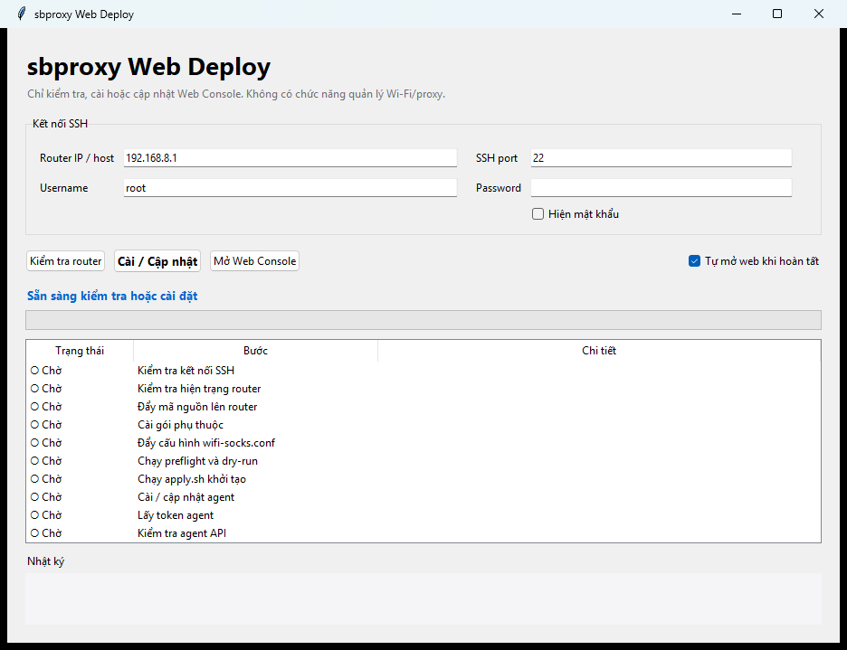

# Cài và cập nhật bằng sbproxy Web Deployer

Web Deployer là công cụ nhỏ để đưa sbproxy Web lên router qua SSH. Công cụ chỉ
thực hiện ba việc: **kiểm tra**, **cài/cập nhật** và **mở Web Console**. Việc quản
lý Wi‑Fi, proxy và thiết bị được thực hiện trong trình duyệt sau khi cài xong.

Nếu muốn quản lý trực tiếp bằng ứng dụng Windows, tải
`sbproxy-console-<version>-windows-x64.exe`. Đây là Desktop Console đầy đủ, khác
với Web Deployer tối giản.



## 1. Chọn file tải về

| Nền tảng | File | Khi nào nên dùng |
|---|---|---|
| Windows x64 | `sbproxy-console-<version>-windows-x64.exe` | Quản lý đầy đủ SSID, proxy, thiết bị, gateway, backup và log |
| Windows x64 | `sbproxy-web-deployer-<version>-windows-x64.exe` | Chạy ngay, không cần giải nén |
| Windows x64 | `sbproxy-web-deploy-<version>-windows-x64.zip` | Gói đầy đủ, có tài liệu, ảnh, checksum và file update thủ công |
| Linux | `sbproxy-web-deploy-<version>-linux-<arch>.tar.gz` | Gói đầy đủ cho đúng kiến trúc Linux |

Windows có thể hiện cảnh báo SmartScreen vì file chưa ký số. Chọn **More info →
Run anyway** sau khi đã tải file từ trang Release chính thức và kiểm tra SHA-256.
Không chạy executable lấy từ nguồn không tin cậy.

## 2. Chuẩn bị router

- Kết nối máy tính và router trong cùng LAN; nên dùng dây mạng khi cài lần đầu.
- Bật SSH và đặt mật khẩu cho tài khoản quản trị router.
- Xác định IP quản trị. GL.iNet thường là `192.168.8.1`; OpenWrt vanilla có thể
  là `192.168.1.1`.
- Windows cần OpenSSH Client; Linux cần `ssh`/`scp` và môi trường desktop.

## 3. Cài hoặc cập nhật

1. Mở Web Deployer.
2. Nhập **Router IP / host**, **SSH port**, **Username** và **Password**.
3. Bấm **Kiểm tra router**. Chỉ tiếp tục khi bước kết nối SSH thành công.
4. Bấm **Cài / Cập nhật** và chờ mọi dòng chuyển sang thành công.
5. Web Console tự mở tại `http://<router>/sbproxy/`. Có thể bấm **Mở Web
   Console** để mở lại.

Mật khẩu SSH chỉ tồn tại trong bộ nhớ của phiên chạy. Khi cập nhật, công cụ giữ
nguyên `wifi-socks.conf`, `proxy-pools.conf` và `settings.sh`; nó không tự apply
lại Wi‑Fi đang hoạt động.

## 4. Cập nhật những lần sau

Tải Web Deployer của bản mới, nhập lại thông tin SSH rồi bấm **Cài / Cập nhật**.
Không cần gỡ bản cũ trên router. Nếu chỉ có file
`sbproxy-update-<version>.tar.gz`, vào Web Console → **Cập nhật** và tải file đó
lên.

## 5. Kiểm tra file tải về

PowerShell:

```powershell
Get-FileHash .\sbproxy-web-deployer-*-windows-x64.exe -Algorithm SHA256
```

Trong gói ZIP/TAR.GZ có `SHA256SUMS`. Sau khi giải nén, Linux kiểm tra bằng:

```sh
sha256sum -c SHA256SUMS
```

## 6. Xử lý lỗi nhanh

| Hiện tượng | Cách kiểm tra |
|---|---|
| Không kết nối SSH | Kiểm tra IP, port, username, password và bảo đảm máy đang ở LAN quản trị |
| Host key đã đổi sau khi flash | Xoá host key cũ bằng `ssh-keygen -R <ip-router>`, rồi thử lại |
| Windows không mở app | Giải nén ZIP hoàn toàn hoặc chạy file standalone; không chạy EXE ngay trong trình xem ZIP |
| Agent API chưa đạt | Chạy lại **Cài / Cập nhật** và xem bước lỗi cùng phần **Nhật ký** |
| Web không tự mở | Mở thủ công `http://<ip-router>/sbproxy/` |

Hướng dẫn cài thủ công và phục hồi chi tiết nằm trong
[Deploy Web từ đầu](WEB-DEPLOY.md). Cách vận hành Wi‑Fi/proxy/thiết bị nằm trong
[Hướng dẫn Web Console](web-console.md).
